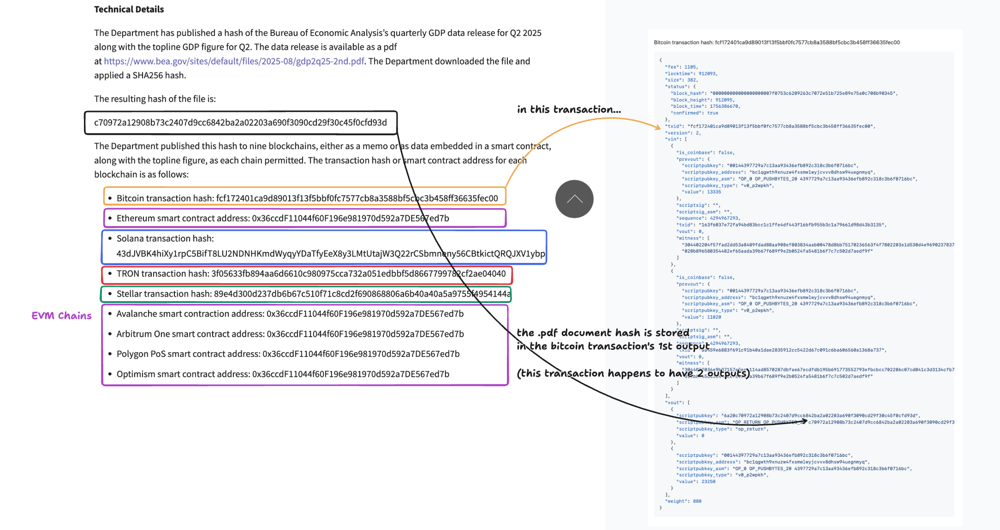

### A hash of the GDP .pdf document was written to 9 blockchains

https://www.commerce.gov/news/press-releases/2025/08/department-commerce-posts-2nd-quarter-gross-domestic-product-blockchain

The SHA-256 hash for the `gdp2q25-2nd.pdf` document is `c70972a12908b73c2407d9cc6842ba2a02203a690f3090cd29f30c45f0cfd93d`, and that value was put on the 9 different chains on August 28, 2026.

This repo is a basic exploration of those transactions.

---

And here's a visual of the btc transaction and its ouput that has the .pdf hash (text string) in it.

